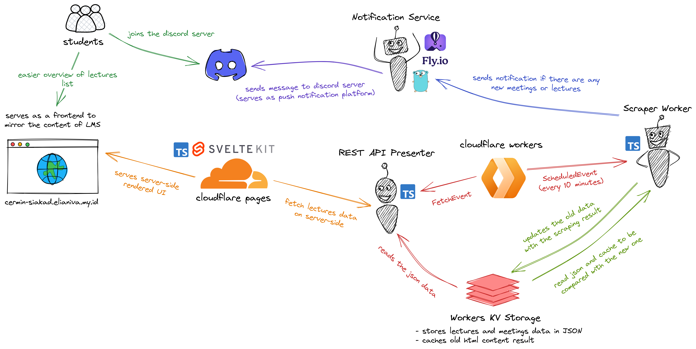
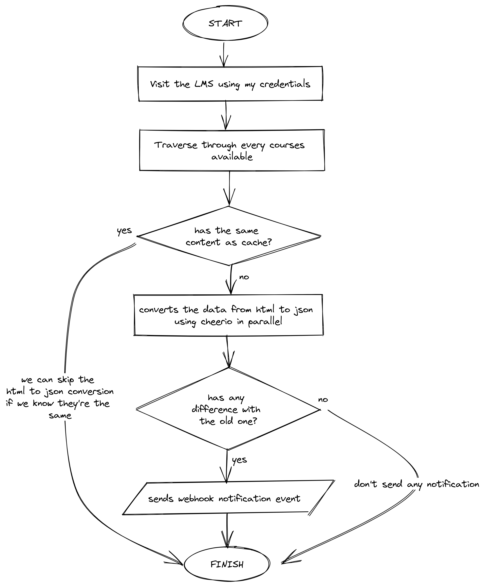

# Hysbysu

> A bot that will watch for any updates on my university LMS. Also serves as a mirror for the LMS.

<small>See the [v1 tag](https://github.com/elianiva/hysbysu/tree/v1) for the old typescript + headless browser version</small>

<small>See the [v2 tag](https://github.com/elianiva/hysbysu/tree/v2) fr the golang version without the headless browser</small>

## Why does this bot exist?

My uni use an LMS to give materials, submit assignments, etc. It's not perfect, but it works for the most part. Here's the dumb thing that I found, it has a notification feature but it never sends any notification whenever there is something new, like, why?? So, at one point, I did my assignment, but because there was no submission form until a few days later, I kinda forgot about it. Because there was no notification, I didn't know if the submission form was posted. Guess what, I didn't submit it because it was already overdue by the time I realised it.

It starts as a fun little project, but I ended up turning it into kinda serious project, which is why I even drew the architecture :p

## Architecture

Initially, it starts as a monolith service when I wrote it in Golang (The worker, API, and Frontend was served by Go hosted on [fly.io](https://fly.io)), but then I decided to rewrite it to use Cloudflare Workers using Typescript.

Cloudflare Workers has its limitation, one of them is it can't run long running process. To tackle this, I split the presenter to be an external service so the worker can just call that. In the future, I might ended up with supporting multiple providers such as adding event to Google Calendar, sending the notification to Telegram, etc, but for now using Discord is enough.

You can visualise the system using this diagram that I made on [Excalidraw](https://excalidraw.com/):

	

<small>It might look messy since I never draw those kind of things before :p</small>

The Notification Service which is used to send the notification to Discord is private, it requires an API key for authorisation. However, the REST API Presenter is open for public in case someone also wants to consume the data. It's available at https://siakad-worker.elianiva.my.id/api/subjects. It's containerised using Docker anad hosted at [Fly.io](https://fly.io) because it's free. The reason why I chose to write it using Go is because it's very lightweight so it's suitable to host on a free platform such aasa Fly.io

I chose SvelteKit as the frontend because it's lightweight, fast to develop, has a good DX, and it's very easy to deploy on [Cloudflare Pages](https://pages.cloudflare.com/). I also need it to do the server-side rendering because I don't want to do client-side fetching. It's accessible at https://cermin-siakad.elianiva.my.id. `cermin` meanas mirror in Bahas Indonesia. I made it because our LMS is not accessible at times, it's quite annoying to be honest.

## How does it work?

Basically it watches the LMS periodically. By default, it will visit the LMS every 10 minutes and check if there is a new update or not. If there isn't, it will save the current snapshot of the courses in form of JSON collected by [cheerio](https://cheerio.js.org/) and compare it if there is an old version of that snapshot. If it sees any difference, it will send a notification to any webhook endpoint that is subscribed. At the moment there's only one webhook endpoint hosted on [fly.io](https://fly.io), which is used to send the notification to Discord.

You can see this flowchart to better visualise how the worker works:

	

After doing that process, the scraped data is stored into [Cloudflare Workers KV](https://www.cloudflare.com/products/workers-kv/). The REST API presenter will pick it up as its data source and serve it to public.

## How to use?
I don't feel like giving usage instruction for this app to random people on Github :p

Go figure it out yourself, or ask me in real life.

## Why the name?
Idk, I picked
it randomly, also, it sounds badass. It means 'notify' in welsh

## Technologies used
- Main Worker
  - [Cloudflare Workers](https://workers.cloudflare.com/)
  - [Cloudflare Workers KV](https://www.cloudflare.com/products/workers-kv/) - Stores the data and used as cache
  - [TailwindCSS](https://tailwindcss.com) - The styling library
  - [Typescript](https://typescriptlang.org) - Programming Language
  - [Hono](https://hono.dev/) - Used to manage routes easily for the presentation layer
  - [ofetch](https://github.com/unjs/ofetch) - A better fetch API
- Frontend Web Presenter
  - [Cloudflare Pages](https://pages.cloudflare.com/) - Host the frontend
  - [Typescript](https://typescriptlang.org) - Programming Language
  - [SvelteKit](https://kit.svelte.dev) - The frontend framework
  - [Cheerio](https://cheerio.js.org) - Used to scrape the data from html content
- Notification Service
  - [Fly.io](https://fly.io/) - Hosts the notification service
  - [Go](https://go.dev/) - Programming Language
  - [DiscordGo](https://github.com/bwmarrin/discordgo) - Library to create the discord bot
  - [Docker](https://www.docker.com/) - Containerise the service so it's easily deployable
