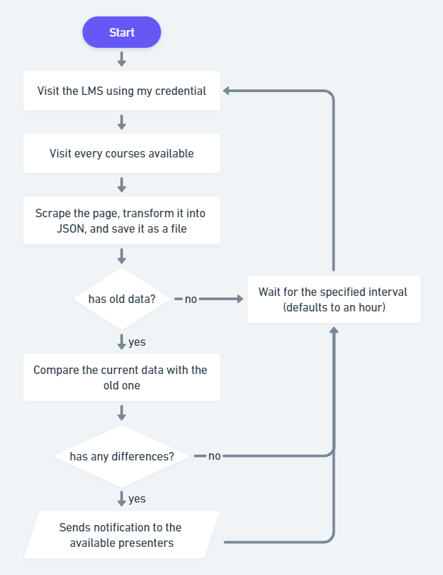

# Hysbysu

> A bot that will watch for any updates on my uni LMS.

<small>See the [v1 tag](https://github.com/elianiva/hysbysu/tree/v1) for the old typescript + headless browser version</small>

## Why does this bot exist?

My uni use an LMS to give materials, submit assignments, etc. It's not perfect, but it works for the most part. Here's the dumb thing that I found, it has a notification feature but it never sends any notification whenever there is something new, like, why?? So, at one point, I did my assignment, but because there was no submission form until a few days later, I kinda forgot about it. Because there was no notification, I didn't know if the submission form was posted. Guess what, I didn't submit it because it was already overdue by the time I realised it.

## How does it work?

Basically it watches the LMS periodically. By default, it will visit the LMS every 10 minutes and check if there is a new update or not. If there isn't, it will save the current snapshot of the courses in form of JSON collected by [goquery](https://github.com/PuerkitoBio/goquery) and compare it if there is an old version of that snapshot. If it sees any difference, it will send a notification to whatever the presenter is implemented. At the moment it is implemented as a Discord bot.

You can see this flowchart to better visualise how it works:

	

## How to use?
Unless you can figure it out by yourself, or you're one of my friend in uni, I'm not gonna tell you :p

I don't feel like giving usage instruction for this app to random people on Github.

## Why the name?
Idk, I picked it randomly, also, it sounds badass. It means 'notify' in welsh

## Tech stack
- [go](https://go.dev)
- [discordgo](https://github.com/bwmarrin/discordgo)
- [goquery](https://github.com/PuerkitoBio/goquery)
